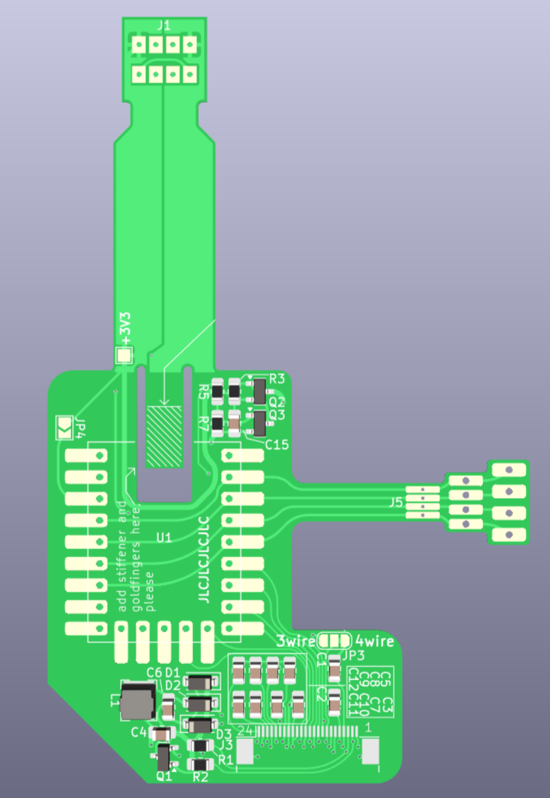

Framework Keypad uses only one of the USB slots,
so we can sneak in a flex PCB and extract USB for
a RP2040-tiny board in the lower half (i.e. left
or right of the touchpad module).

Parameters (JLCPCB)
----------

- Flex PCB, 2 layers
- PCB Thickness: 0.11 mm
- Coverlay Color: Yellow
- Gold: 1U
- Copper: 1/3 oz (12 um)
- Gold Fingers: yes, 0.3 mm
- Stiffener: Polyimide, 0.225 mm
